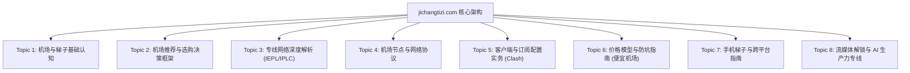

# SITE_TOPIC_MAP.md — 机场梯子全站主题架构图谱

**站点定位**：机场梯子 (jichangtizi.com) — 调查新闻晚报与机场消费档案库  
**核心方向**：机场选择指南，新手机场教程，梯子工具科普  
**主数据源驱动**：`KeywordStats_2026_9_18 (1).csv` (144 核心词表)  
**架构版本**：V4.4 User CSV Realignment Standard  

---

## 全站八大主题集群 (Topic Clusters Architecture)

全站信息架构严格围绕用户 CSV 关键词文件规划为 8 大核心主题集群，形成从基础认知、选型决策、底层网络、协议节点、客户端实操、防坑避险、移动设备配置到高端生产力场景的完整覆盖闭环。

---

### Topic 1: 机场与梯子基础认知
- **定位与目标**：厘清“机场”、“VPN”、“梯子工具”、“加速器”的本质概念与技术区别，消除中文互联网常见术语混淆。
- **关联文章**：[`src/content/blog/airport-vs-vpn-difference.md`](file:///c:/Users/USER/Desktop/新建文件夹%20(3)/blog/all%20blog/8.4博客（test）/src/content/blog/airport-vs-vpn-difference.md)
- **对应用户 CSV 关键词家族**：
  - `vpn` (Impression: 2,724,738)
  - `梯子工具` (Impression: 24,456)
  - `翻墙` (Impression: 9,165)
  - `vpn梯子` (Impression: 1,675)
  - `翻墙梯子` (Impression: 1,574)
  - `梯子软件` (Impression: 1,532)
  - `翻墙软件` (Impression: 1,247)
  - `梯子` (Impression: 1,154)
- **承载页面**：`/blog/airport-vs-vpn-difference/`、`/about/`
- **内部链接枢纽**：指向 Topic 2 (选购决策) 及 Topic 5 (客户端配置)。

---

### Topic 2: 机场推荐与选购决策框架
- **定位与目标**：建立理性、中立的机场选购评估体系，引导用户按月试用，避免盲目年付与跑路风险。
- **关联文章**：[`src/content/blog/how-to-choose-airport.md`](file:///c:/Users/USER/Desktop/新建文件夹%20(3)/blog/all%20blog/8.4博客（test）/src/content/blog/how-to-choose-airport.md)
- **对应用户 CSV 关键词家族**：
  - `机场推荐` (Impression: 79,784)
  - `性价比机场` (Impression: 28,260)
  - `梯子推荐` (Impression: 13,945)
  - `好用的梯子` (Impression: 9,812)
  - `稳定机场` (Impression: 2,873)
  - `机场推荐测评` (Impression: 2,737)
- **承载页面**：`/` (首页核心定位)、`/airports/` (31家服务商客观档案库)、`/blog/how-to-choose-airport/`
- **内部链接枢纽**：直接连接全站机场档案卡片 `/airport/[slug]/` 与筛选器。

---

### Topic 3: 专线网络深度解析 (IEPL / IPLC / BGP)
- **定位与目标**：从物理光缆与网络传输层级深度拆解 IEPL、IPLC 内网专线与普通公网中转的本质区别，解释晚高峰拥堵的物理根源。
- **关联文章**：[`src/content/blog/iepl-iplc-line-guide.md`](file:///c:/Users/USER/Desktop/新建文件夹%20(3)/blog/all%20blog/8.4博客（test）/src/content/blog/iepl-iplc-line-guide.md)
- **对应用户 CSV 关键词家族**：
  - `稳定机场` (Impression: 2,873)
  - `专线机场`
  - `iepl专线`
  - `iplc专线`
- **承载页面**：`/blog/iepl-iplc-line-guide/`、`/airports/?line=iepl` 线路切片筛选
- **内部链接枢纽**：指向 Topic 4 (节点协议) 与具体专线服务商档案。

---

### Topic 4: 机场节点与网络协议
- **定位与目标**：系统科普机场节点、代理节点、VPN 节点的拓扑架构（入口-中转-落地），解析 Shadowsocks、VMess、Trojan、Hysteria2 协议特性及节点倍率逻辑。
- **关联文章**：[`src/content/blog/airport-node-concepts.md`](file:///c:/Users/USER/Desktop/新建文件夹%20(3)/blog/all%20blog/8.4博客（test）/src/content/blog/airport-node-concepts.md)
- **对应用户 CSV 关键词家族**：
  - `机场节点` (Impression: 9,627)
  - `代理节点`
  - `vpn节点`
  - `梯子节点`
  - `翻墙节点`
  - `节点倍率`
- **承载页面**：`/blog/airport-node-concepts/`、`/airports/`
- **内部链接枢纽**：指向 Topic 5 (客户端导入) 与 Topic 7 (手机端配置)。

---

### Topic 5: 客户端与订阅配置实务 (Clash / Sing-box)
- **定位与目标**：从零教学主流客户端（Clash Verge Rev、Sing-box、Mihomo）订阅导入、分流模式（Rule/Global/Direct）、TUN 模式开启与排障。
- **关联文章**：[`src/content/blog/beginner-clash-guide.md`](file:///c:/Users/USER/Desktop/新建文件夹%20(3)/blog/all%20blog/8.4博客（test）/src/content/blog/beginner-clash-guide.md)
- **对应用户 CSV 关键词家族**：
  - `机场推荐 clash` (Impression: 10,065)
  - `机场订阅` (Impression: 5,369)
  - `clash节点` (Impression: 5,172)
  - `clash订阅` (Impression: 3,803)
  - `梯子订阅` (Impression: 1,232)
  - `clash机场推荐` (Impression: 1,155)
- **承载页面**：`/blog/beginner-clash-guide/`、`/airports/`
- **内部链接枢纽**：指向各机场档案页中的“客户端配置支持”字段。

---

### Topic 6: 价格模型与防坑指南 (便宜机场风险)
- **定位与目标**：拆解低价年付陷阱、超售机制、买断制不限时流量包与周期套餐的优劣势，建立透明消费观。
- **关联文章**：[`src/content/blog/airport-pricing-traps.md`](file:///c:/Users/USER/Desktop/新建文件夹%20(3)/blog/all%20blog/8.4博客（test）/src/content/blog/airport-pricing-traps.md)
- **对应用户 CSV 关键词家族**：
  - `便宜机场` (Impression: 6,176)
  - `便宜梯子` (Impression: 3,767)
  - `免费梯子` (Impression: 2,735)
  - `好用的便宜机场推荐` (Impression: 1,714)
  - `便宜好用的梯子` (Impression: 1,061)
- **承载页面**：`/blog/airport-pricing-traps/`、`/airports/?price=budget`
- **内部链接枢纽**：指向 Topic 2 (选购框架) 与按月预算筛选。

---

### Topic 7: 手机梯子与跨平台科学上网指南
- **定位与目标**：覆盖 iOS (Shadowrocket/Stash)、Android (Clash Meta/Flclash)、Windows、macOS 跨平台配置方案，重点解决手机端息屏杀后台断流与电池优化问题。
- **关联文章**：[`src/content/blog/device-setup-guide.md`](file:///c:/Users/USER/Desktop/新建文件夹%20(3)/blog/all%20blog/8.4博客（test）/src/content/blog/device-setup-guide.md)
- **对应用户 CSV 关键词家族**：
  - `手机梯子` (Impression: 1,672)
  - `手机梯子推荐` (Impression: 1,349)
  - `电脑梯子` (Impression: 1,003)
  - `手机翻墙` (Impression: 1,061)
  - `电脑机场`
- **承载页面**：`/blog/device-setup-guide/`
- **内部链接枢纽**：指向 Topic 5 (Clash 教程) 与各设备客户端指南。

---

### Topic 8: 流媒体解锁与 AI 生产力专线
- **定位与目标**：深入解析 OpenAI (ChatGPT)、Anthropic (Claude) 以及 Netflix、Disney+ 对出站 IP 的信誉风控模型，指导原生住宅 IP 与防止 DNS 泄漏配置。
- **关联文章**：[`src/content/blog/ai-and-streaming-network-requirements.md`](file:///c:/Users/USER/Desktop/新建文件夹%20(3)/blog/all%20blog/8.4博客（test）/src/content/blog/ai-and-streaming-network-requirements.md)
- **对应用户 CSV 关键词家族**：
  - `访问ChatGPT网络要求`
  - `原生IP节点`
  - `流媒体解锁`
  - `ChatGPT节点`
- **承载页面**：`/blog/ai-and-streaming-network-requirements/`
- **内部链接枢纽**：指向支持原生解锁的服务商档案。
